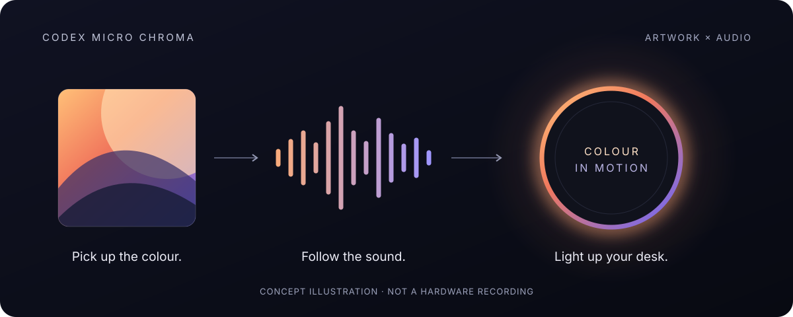

<div align="center">

# Codex Micro Chroma

**Your artwork. Your audio. Your desk, in colour.**

Turn your Work Louder Codex Micro's LED ring into an extension of what you're playing.
Artwork sets the colour. Sound shapes the motion. Everything runs on your Mac.

[](https://github.com/hauntedfail/Codex-Micro-Chroma/releases/latest) [](https://github.com/hauntedfail/Codex-Micro-Chroma/actions/workflows/ci.yml) [](#requirements) [](LICENSE)

[Get started](#get-started) · [Effects](#lighting-effects) · [Compatibility](#compatibility) · [Technical guide](docs/guide.md)



</div>

Reading this from a release archive? [Open the illustrated README and full guide on GitHub](https://github.com/hauntedfail/Codex-Micro-Chroma#readme).

## From Now Playing to your desk

- **A colour for every track.** Picks a representative colour from the artwork or video thumbnail in macOS Now Playing, then adjusts it for the LEDs.
- **Light that moves with the audio.** Loudness, bass, rhythm, and stereo width shape the brightness, speed, and choice of effect.
- **Use the player you already have.** Reads macOS Now Playing, with no music-service account to connect. Artwork availability depends on the player; see [compatibility](#compatibility).
- **Keep it local.** No runtime network connection, API keys, OAuth, or AI models. Raw audio stays in memory; diagnostic logs remain on your Mac.
- **Make it part of your setup.** Run in the terminal or install a background worker that starts at login. Choose a fixed effect with static mode when you only want artwork colours.

## Get started

### Requirements

You need **macOS 14.2 or later**, **one connected Work Louder Codex Micro**, and a player that publishes artwork to macOS Now Playing. The release binary supports Apple Silicon and Intel; Rust is only needed to build from source.

### 1. Download

Get the universal macOS archive and its matching `.sha256` file from **[GitHub Releases](https://github.com/hauntedfail/Codex-Micro-Chroma/releases/latest)**. The latest published release is **v0.1.0**.

<details>
<summary>Download and verify from the terminal</summary>

```bash
VERSION=0.1.0
BASE_URL="https://github.com/hauntedfail/Codex-Micro-Chroma/releases/download/v${VERSION}"
ARCHIVE="codex-micro-chroma-v${VERSION}-macos-universal.tar.gz"

curl -fLO "${BASE_URL}/${ARCHIVE}" &&
curl -fLO "${BASE_URL}/${ARCHIVE}.sha256" &&
shasum -a 256 -c "${ARCHIVE}.sha256" &&
tar -xzf "${ARCHIVE}" &&
cd "codex-micro-chroma-v${VERSION}-macos-universal" &&
./codex-micro-chroma --version
```

</details>

The binary is ad-hoc signed, **not Developer ID signed or notarised**. macOS may require first-launch approval in **System Settings → Privacy & Security**.

### 2. Connect and check

Connect your Codex Micro and play something with Now Playing artwork. From the extracted release directory, run:

```bash
./codex-micro-chroma probe
./codex-micro-chroma status
```

`probe` checks the device and MediaRemote connection. `status` shows the current media and detected artwork colour.

Approve the relevant permissions in **System Settings → Privacy & Security**:

| Permission | Used for |
| --- | --- |
| **Input Monitoring** | Access to the Codex Micro over USB HID. If `probe` reports `not permitted`, enable your terminal app and retry. |
| **Screen & System Audio Recording** or **System Audio Recording Only** | Local audio analysis in reactive mode. macOS requests this when audio capture starts. |

### 3. Turn on the lights

```bash
./codex-micro-chroma run
```

The ring follows the artwork colour while effects respond to the audio. Stop with **Ctrl-C** to clear the lighting. Prefer an artwork colour with a fixed effect and no system-audio capture?

```bash
./codex-micro-chroma run --mode static --effect breath
```

For login startup, stop the foreground process and run `./codex-micro-chroma install`. This starts a background worker in the default reactive mode. The **installed worker may need its own privacy approvals**; follow the [background setup guide](docs/guide.md#start-automatically-at-login).

## Lighting effects

Reactive mode chooses effects from the audio's character, with smoothing and minimum hold times to avoid rapid switching. These are selection tendencies, not a fixed mapping for every track.

| What you're hearing | Effect |
| --- | --- |
| Strong bass and a steady pulse | `snake` |
| Smooth, sustained tones | `breath` |
| Wide stereo sound | `gradient` |
| Loud, rapidly changing passages with strong onsets | `rainbow` |
| Quiet passages, introductions, and outros | `shallow-breath` |
| Speech or centred sound | `solid` |
| Sustained silence or stopped playback | `off` |

Try a colour and effect directly, without a media player. Stop any running worker first so it does not overwrite your selection:

```bash
./codex-micro-chroma set --color '#F2A577' --effect snake
./codex-micro-chroma off
```

`off` clears both the key lighting and ambient ring controlled by this tool. See the [usage reference](docs/guide.md#usage) for brightness, speed, timing, and audio diagnostics.

## Compatibility

**Early-stage hardware project.** The integration reads macOS Now Playing rather than individual service APIs, but each player must publish usable artwork.

| Path | Validation status |
| --- | --- |
| Browser / Helium | Verified in the project's existing testing |
| Apple Music / Spotify | Artwork and colour output still need validation on the target Mac |
| Other music players, video players, and browsers | Depend on Now Playing artwork; not individually verified |
| Extended sessions and hardware effect tuning | Long-running reconnect behaviour and final calibration still need validation |

When multiple apps play at once, the artwork colour comes from the selected Now Playing session. **Reactive effects analyse the full mixed system output**, so they can respond to audio from other apps too.

Now Playing access uses Apple's private **MediaRemote** framework. macOS updates may affect it, and this approach is not suitable for App Store distribution. See [how it works](docs/guide.md#how-it-works) for session selection and input limits.

## Need a hand?

| Symptom or task | Where to start |
| --- | --- |
| Device access fails or the worker waits | Connect one device and check [permissions](docs/guide.md#required-user-interaction-and-permissions). |
| No artwork colour | Run `status`; check whether the current player publishes artwork. |
| Colour works, but audio response does not | Run `audio-probe --seconds 15` and check system-audio permission. |
| Terminal works, login startup does not | Approve the [installed worker](docs/guide.md#start-automatically-at-login), then inspect `worker-error.log`. |
| Stop and remove the login worker | Use the [uninstall instructions](docs/guide.md#start-automatically-at-login); diagnostic logs are preserved. |

## Build and contribute

With **Rust 1.88+** and **Xcode Command Line Tools** installed:

```bash
git clone https://github.com/hauntedfail/Codex-Micro-Chroma.git
cd Codex-Micro-Chroma
cargo build --release --locked
./target/release/codex-micro-chroma --help
```

Use `./target/release/codex-micro-chroma` in place of `./codex-micro-chroma` in the examples above.

Have a Codex Micro? [Report a player test or a bug](https://github.com/hauntedfail/Codex-Micro-Chroma/issues), or share a short clip of your lighting setup. Include your macOS version, player/browser, Chroma version, and what you expected to see. Review diagnostic logs before sharing: they can contain media titles and source applications.

Code contributions are welcome. See the guide for [development checks](docs/guide.md#development), [per-track logs](docs/guide.md#per-track-effect-logs), and [release publishing](docs/guide.md#publishing-a-release).

If this belongs on your desk, **give the project a star** so you can find it again.

## Licence

[MIT](LICENSE). “Codex Micro” refers to the Work Louder hardware; no OpenAI or Codex model is used.
